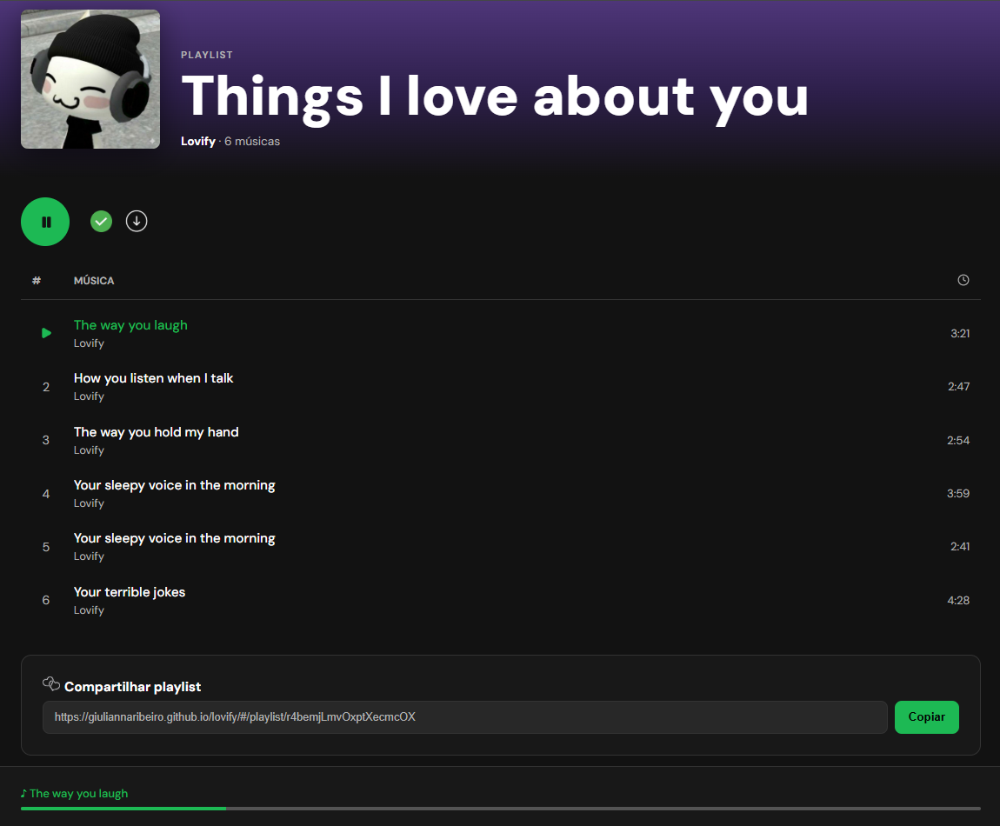

# ❤️ Lovify

Lovify is a web application built with React 19 and Vite, created for **Dia dos Namorados** (Brazilian Valentine's Day, June 12th), that lets users create and share a personalized playlist for their partner, perfect for **Valentine's Day**, anniversaries, or just because. Each track can be a quality or little thing you love about them. The app uses **Firebase Firestore** for storage and offers a fully responsive, Spotify-inspired interface.

**Live demo:** [giuliannaribeiro.github.io/lovify](https://giuliannaribeiro.github.io/lovify/)

---

## ✅ Features

- **Playlist Creation**: Customize name, cover photo, and track list
- **Love as Tracks**: Each "song" can be a quality, habit, or little thing you adore about your partner
- **Photo Upload**: Optional cover image with a default fallback
- **Dynamic Track List**: Add, remove, and edit tracks with auto-generated durations
- **Spotify-Style Player UI**: Hero section, play/pause controls, track list, and now-playing bar
- **Shareable Link**: Each playlist gets a unique URL to send to your partner
- **Copy to Clipboard**: One-click link copying with visual feedback
- **Loading Screen**: Animated heart icon while the playlist loads
- **Responsive Design**: Optimized layout for mobile and desktop

## 🛠️ Technologies

- React 19 (with Hooks and Functional Components)
- TypeScript
- Vite 8
- React Router DOM 7
- Firebase Firestore
- Lucide React (icons)
- CSS3 (custom Spotify-inspired theme)
- gh-pages

## 🚀 Installation & Running

**Clone the repository**

```bash
git clone https://github.com/GiuliannaRibeiro/lovify.git
cd lovify
```

**Install dependencies**

```bash
npm install
```

**Run the development server**

```bash
npm run dev
```

The app will be available at `http://localhost:5173/lovify/`

## 🖼️ App Preview

**Creation Form**


**Generated Playlist**


